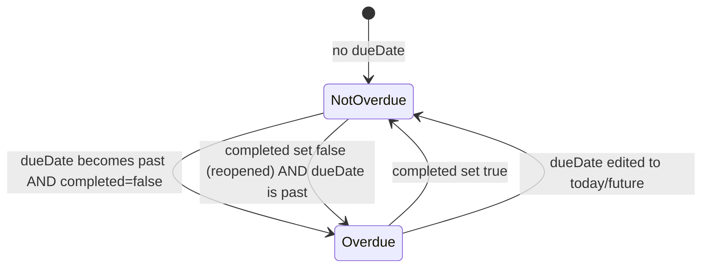

# Phase 1 Data Model: Support for Overdue Todo Items

## Overview

This feature introduces no new persisted entities or fields. It adds one **derived value**
computed from the existing `Todo` entity at render time.

## Existing Entity: Todo (unchanged)

Sourced from `packages/backend/src/services/todoService.js` / `packages/frontend/src/services/todoService.js`.

| Field       | Type                  | Notes                                              |
|-------------|-----------------------|-----------------------------------------------------|
| `id`        | number                | Unchanged                                            |
| `title`     | string                | Unchanged                                            |
| `dueDate`   | string (`YYYY-MM-DD`) or `null` | Unchanged. Optional.                      |
| `completed` | number (`0` or `1`)   | Unchanged                                            |
| `createdAt` | string (ISO datetime) | Unchanged                                            |

No fields are added, removed, or modified. No migration is required.

## Derived Value: `overdue`

| Property     | Description |
|--------------|--------------|
| **Name**     | `overdue` (not persisted; computed on demand) |
| **Type**     | `boolean` |
| **Computed from** | `todo.dueDate`, `todo.completed`, and the current date at render time |
| **Computation** | `overdue = dueDate !== null && !completed && dueDateOnly < todayDateOnly` (calendar-date comparison, per [research.md](./research.md)) |
| **Lifecycle** | Recomputed on every render; never stored, cached, or sent to/from the backend |

### Validation / Business Rules (from spec Functional Requirements)

- FR-001: `overdue` is `true` only when `dueDate` is earlier than today's date AND `completed`
  is falsy.
- FR-002: `overdue` is always `false` when `dueDate` is `null`/absent.
- FR-003: `overdue` is always `false` when `completed` is truthy, regardless of `dueDate`.
- FR-007: `overdue` MUST be recomputed at each render (no cached/stale boolean stored on the
  todo object or in component state).

### State Transitions

`overdue` is not a stored state machine field — it has no transitions of its own. It is a pure
function of the existing `dueDate`/`completed` transitions already supported by the app:



## Interface: `isOverdue(todo)` utility

Not a persisted contract, but the internal shape consumed by `TodoCard.js`:

```text
isOverdue(todo: { dueDate: string|null, completed: number|boolean }) => boolean
```

- Pure function, no side effects, no dependencies on component state or the DOM.
- Input: a todo-shaped object (only `dueDate` and `completed` are read).
- Output: boolean overdue status per the rules above.
